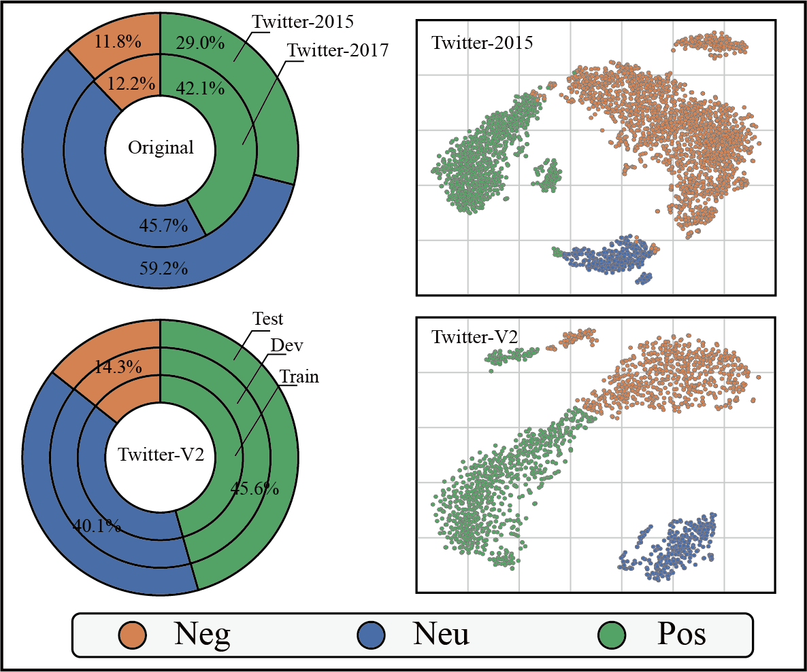

<h1 align="center">
LLM-based Knowledge Enhanced for Multimodal Aspect Based Sentiment Analysis
</h1>

  <a href="#-Updates">✨ Updates</a> •
  <a href="#-Abstract">💡 Abstract</a> •
  <a href="#-Dataset">📦 Datasets</a> •
  <a href="#-Results">📜 Results</a> •
  <a href="#-Codes">🔗 Codes</a> •
  <a href="#-License">🔑 License</a> •
  <a href="#-Acknowledgements">💗Acknowledgements</a>

**Code and dataset for paper**: LLM-based Knowledge Enhancement and Sentiment Filter Network for Multimodal Aspect-Based Sentiment Analysis

## ✨ Updates
- 2025/7/27 Anonymize Git repository
- 2025/7/25 update the code and  Twitter-V2
- 2025/4/13 upload the dataset.
- 2025/4/11 create the git and add the README.

## 💡 Abstract

Multimodal aspect‑based sentiment analysis (MABSA) seeks to infer sentiment polarity from user posts. Existing methods face two core challenges. First, heterogeneous data structures yield divergent sentiment expressions across modalities, making independently learned features hard to align. Second, image–text mismatch introduces noise, and indiscriminate use of images can therefore impair performance. To address these challenges, we propose a multimodal Large Language Model  based Knowledge Enhancement network (LLM‑KE) that couples a BART encoder–decoder. Specifically, a knowledge miner distills content‑aware and sentiment‑aware knowledge from images to unify the data structure, whereas a sentiment filter evaluates image–text relevance and regulates the use of visual sentiment cues. In experiments, to remedy sentiment label imbalance and pseudo‑label noise in Twitter2015 and Twitter2017, we introduce a sentiment reasoning chain that supplements missing context and corrects labels, yielding a more balanced, higher‑quality Twitter‑V2 dataset. Experiments on several public benchmarks demonstrate that LLM‑KE achieves state‑of‑the‑art performance on MABSA.

## 📦 Dataset

In this paper, we reconstruct and publish the Twitter-V2. The main modifications are deleting incorrect aspect terms and sensitive data, adding missing aspect terms, and balancing the distribution of sentiment labels.

- 📚 Twitter-2015, Twitter-2017 and Twitter-V2 can be download from *Webdev* (Publication after review).

Table1. The data statistics of Twitter2015, Twitter2017 and Twitter-V2 as follows.

|  Dateset  | Twitter2017 |         |         | Twitter2015 |         |         | Twitter-V2 |         |         |
| :-------: | :---------: | :-----: | :-----: | :---------: | :-----: | :-----: | :--------: | :-----: | :-----: |
|           |   **POS**   | **NEU** | **NEG** |   **POS**   | **NEU** | **NEG** |  **POS**   | **NEU** | **NEG** |
| **Train** |    1508     |  1638   |   416   |     928     |  1883   |   368   |    3039    |  2673   |   952   |
|  **Dev**  |     515     |   517   |   144   |     303     |   670   |   149   |    1013    |   891   |   317   |
| **Test**  |     493     |   573   |   168   |     317     |   607   |   113   |    1013    |   891   |   319   |
|  **All**  |    2516     |  2728   |   728   |    1548     |  3160   |   630   |    2516    |  2728   |   728   |

- 📊 To investigate the impact of data reconstruction on model representation learning, we perform t-SNE visualization on feature representations learned from both the original and modified datasets.

Figute1. t-SNE distribution and sentiment label statistics.

## 📜 Results

1. The main results of subtask ASPE as bellow.

Table2. Main Results of ASPE. The best in bold and the second in underline.

| Models                  |             | Twitter2017 |             |             | Twitter2015 |             |             | TwitterV2   |             |
| :---------------------- | :---------- | :---------- | :---------- | :---------- | :---------- | :---------- | :---------- | :---------- | :---------- |
|                         | $P$         | $R$         | $F1$        | $P$         | $R$         | $F1$        | $P$         | $R$         | $F1$        |
| SPAN(2019)              | 59.6        | 61.7        | 60.6        | 53.7        | 53.9        | 53.8        | 48.2        | 53.1        | 50.6        |
| D-GCN(2020)             | 64.2        | 64.1        | 64.1        | 58.3        | 58.8        | 59.4        | 51.7        | 54.8        | 53.2        |
| BART(2021)              | 65.2        | 65.6        | 65.4        | 62.9        | 65.0        | 63.9        | 58.7        | 60.1        | 59.4        |
| DeepSeek-V3-70B†(2025)  | 27.9        | 33.1        | 30.3        | 26.7        | 41.5        | 32.5        | 17.4        | 30.2        | 22.1        |
| Llava-34-B†(2023)       | 9.6         | 15.9        | 11.9        | 7.0         | 15.2        | 9.6         | 7.2         | 17.4        | 10.2        |
| GPT-4o-mini‡(2024)      | 20.8        | 19.3        | 20.0        | 15.8        | 24.0        | 19.1        | 15.5        | 22.8        | 18.4        |
| Llama-3.2-vision†(2024) | 21.4        | 23.5        | 22.4        | 11.9        | 15.3        | 13.4        | 13.0        | 20.3        | 15.9        |
| JML(2021)               | 66.5        | 65.5        | 66.0        | 65.0        | 63.2        | 64.1        | 62.6        | 64.8        | 63.7        |
| VLP-MABSA(2022)         | 66.9        | 69.2        | 68.0        | 65.1        | 68.3        | 66.6        | 63.7        | 64.1        | 63.9        |
| CMMT(2022)              | 67.6        | 69.4        | 68.5        | 64.6        | 68.7        | 66.5        | 61.2        | 65.6        | 63.6        |
| AoM(2023)               | 68.4        | 71.0        | 69.7        | 67.9        | 69.3        | 68.6        | <u>64.4</u> | <u>65.9</u> | <u>65.1</u> |
| TCMT(2025)              | <u>70.2</u>        | <u>71.5</u>        | <u>70.8</u>        | **69.3** | <u>70.4</u>        | **69.8** | -           | -           | -           |
| **LLM-KE**              | **72.0**    | **73.5**    | **72.7**    | <u>68.1</u>        | **70.8** | <u>69.4</u>        | **67.2**    | **67.8**    | **67.5**    |

2. The main results of subtask MASC as bellow.

Table3. Main Results of MASC. The best in bold and the second in underline.

| Models                  | Twitter2017 |             | Twitter2015 |             | TwitterV2   |             |
| :---------------------- | :---------- | :---------- | :---------- | :---------- | :---------- | :---------- |
|                         | $ACC$       | $F1$        | $ACC$       | $F1$        | $ACC$       | $F1$        |
| Deepseek-v3-70B†(2025)  | 62.7        | 53.8        | 67.3        | 53.1        | 63.1        | 53.9        |
| Llava-34B†(2023)        | 18.7        | 15.8        | 13.9        | 12.6        | 19.7        | 13.6        |
| GPT-4o-mini‡(2024)      | 56.2        | 54.1        | 52.4        | 53.3        | 67.1        | 64.0        |
| Llama-3.2-vision†(2024) | 50.0        | 43.5        | 38.7        | 36.2        | 57.5        | 48.8        |
| JML(2021)               | 72.7        | -           | 78.7        | -           | 63.1        | -           |
| CMMT(2022)              | 73.8        | -           | 77.9        | -           | 66.3        | -           |
| VLP-MABSA(2022)         | 73.8        | 71.8        | 78.6        | 73.8        | 65.3        | 65.2        |
| AoM(2023)               | 76.4        | 75.0        | 80.2 | 75.9 | 69.3        | 67.7        |
| Image2Text(2024)        | 74.5        | 73.1        | 79.5        | 75.1        | <u>70.4</u> | <u>69.9</u> |
| DEQA(2025)              | <u>75.8</u> | <u>75.1</u> | **82.1**    | **77.6**    | -           | -           |
| LLM-KE                  | **78.1**    | **76.8**    | <u>81.5</u>       | <u>76.3</u>        | **74.5**    | **75.1**    |

## 🔗 Codes

- **Status**: Under review.

During the paper review stage, we have released the dataset and the core model code. The remaining components are currently under inspection and will be updated as soon as the paper is published.

## 🔑 License

Distributed under the MIT License. See [MIT LICENSE](https://opensource.org/license/MIT) for more information.

## 💗 Acknowledgements

Our code depends on project [MABSA-VLP](https://github.com/NUSTM/VLP-MABSA), many thanks!
